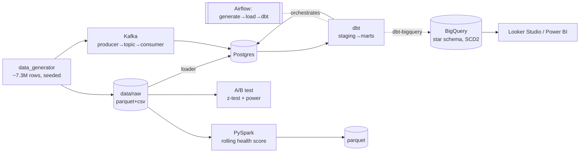

# gulf-health-lakehouse

> **I rebuilt my production health-tech data domain on an open, modern data stack.**

A portfolio monorepo that reproduces a consumer health-tech data domain
(wearables, body-composition scans, nutrition logs) on an open stack —
**Docker · dbt · Airflow · BigQuery · Kafka · PySpark** — with an A/B-testing
analysis and BI dashboards on top. One repo, one story.

> ⚠️ **All data is 100% synthetic**, generated with `numpy` + `Faker`
> ([`data_generator/`](data_generator/)). **No real user data** is anywhere in
> this repo, and no performance claims are made about the synthetic project.

---

## Why this exists

I'm a Python-first data engineer who owns an automated AWS ETL pipeline ingesting
10k+ daily wearable records at a health-tech app. This repo is the open-stack
public demonstration of that same problem domain — realistic synthetic data, a
warehouse-centric transform layer, orchestration, streaming, and a heavy batch
job — all reproducible by hand and documented with one ADR per phase.

## Architecture



Full diagram + data flow + ER model: [`docs/architecture.md`](docs/architecture.md).

## Tech stack

Python 3.11 · PostgreSQL 16 · dbt-core 1.8 (postgres + bigquery) · Airflow 2.9
(Docker) · Kafka (KRaft) · PySpark 3.5 · BigQuery · pandas/numpy/scipy/Faker ·
pytest · ruff.

## Quickstart

```bash
# 0) environment
python -m venv .venv && source .venv/bin/activate   # Windows: .venv\Scripts\activate
pip install -e ".[dev,dbt]"
cp .env.example .env

# 1) generate the synthetic dataset (full set; or --users N --months M)
make generate            # -> data/raw/*.parquet|csv  (+ committed sample)

# 2) bring up Postgres + load (Docker)
make up && make load     # generate+load inside the runner container

# 3) transform with dbt (10+ models, 50+ tests)
make dbt-deps && make dbt
make dbt-docs            # lineage graph

# 4) A/B analysis (z-test, power, plots, writeup)
make ab-test

# 5) orchestration — Airflow at http://localhost:8080 (admin/admin)
make airflow-build && make airflow-up && make airflow-trigger

# 6) streaming — Kafka producer -> topic -> consumer -> Postgres
make kafka-up && make kafka-topic && make kafka-produce && make kafka-consume

# 7) heavy batch — rolling 30-day health score over the full history
#    needs Java 17 (+ winutils on Windows) — see batch/spark/README.md
make spark
```

`make help` lists every target.

## What's in each phase

| Phase | Area | Highlights | ADR |
|------:|------|------------|-----|
| 0 | [Data generation](data_generator/) | seeded, correlated, ~7.3M rows, parquet+csv | [0001](docs/adr/0001-synthetic-data-foundation.md) |
| 1 | [Docker](Dockerfile) | slim image, cache-ordered layers, non-root, healthcheck | [0002](docs/adr/0002-docker.md) |
| 2 | [A/B testing](analysis/ab_test/) | two-proportion z-test + Welch t-test, power/sample-size | [0003](docs/adr/0003-ab-testing.md) |
| 3 | [dbt](transform/dbt/) | star schema, 14 models, 59 tests, incremental fact | [0004](docs/adr/0004-dbt.md) |
| 4 | [Airflow](orchestration/airflow/) | generate→load→dbt DAG, retries, SLA, backfill | [0005](docs/adr/0005-airflow.md) |
| 5 | [BigQuery](warehouse/) | partitioning, `user_id` clustering, SCD2 (offline) | [0006](docs/adr/0006-bigquery.md) |
| 6 | [Kafka](streaming/) | KRaft, keyed producer (`acks=all`), consumer group | [0007](docs/adr/0007-kafka.md) |
| 7 | [PySpark](batch/spark/) | rolling 30-day score: window + broadcast + repartition | [0008](docs/adr/0008-pyspark.md) |
| 8 | [Dashboards](dashboards/) | Looker Studio + Power BI on the warehouse | — |

Each ADR answers the "interview check" questions for that phase — they double as
study notes.

## Testing & CI

`pytest` covers the generator, the A/B math (validated vs scipy + textbook
values), ingestion, and the Spark job (skips cleanly without Java). CI
([`.github/workflows/ci.yml`](.github/workflows/ci.yml)) runs **ruff lint**,
**`dbt parse`**, and **pytest** on every push.

```bash
make lint && make test
```

## Notes & honesty

- The A/B result is **underpowered by design** (500 synthetic users) — a
  non-significant result is reported as inconclusive, not as "no effect".
- BigQuery is **built offline**: models compile against the BQ adapter and the
  partition/cluster config is verified, but a single credential TODO remains at
  the boundary (the provided project id also looks truncated).
- Kafka and Spark are kept to honest scope: topic design + producer/consumer (no
  cluster ops); one heavy, justified Spark job (no framework).

## License

[MIT](LICENSE)
