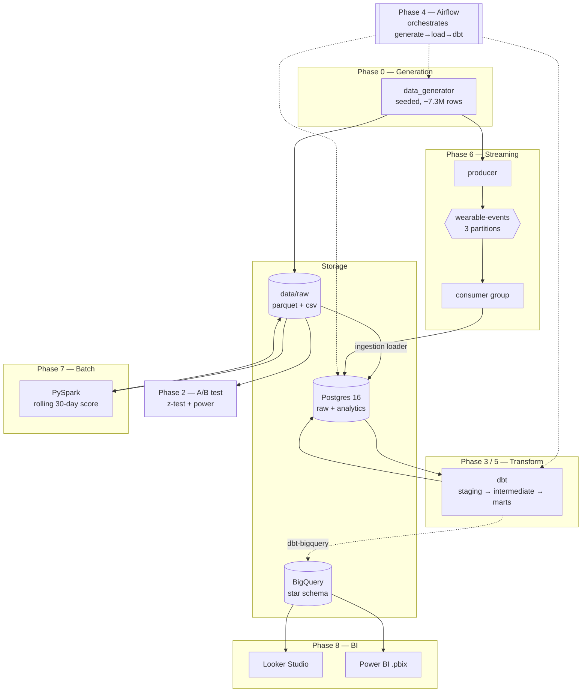
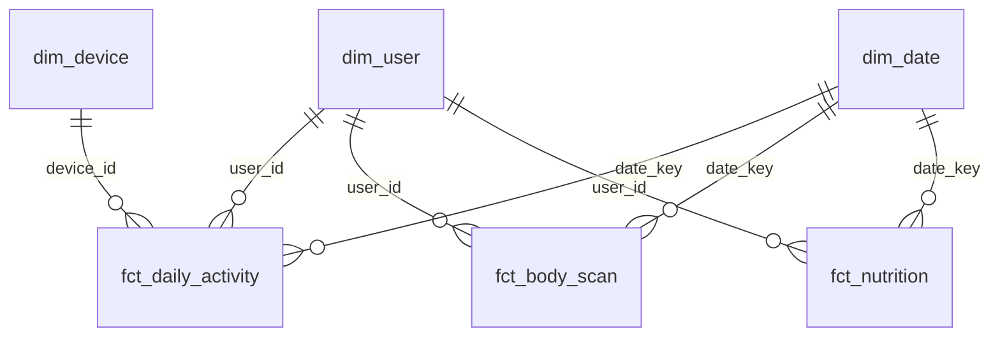

# Architecture

> All data is **synthetic** (generated with numpy + Faker). No real users.

## System overview

## Data flow (happy path)

1. **Generate** — `data_generator` writes parquet + csv to `data/raw/`
   (deterministic; full set ~7.3M rows).
2. **Ingest** — `ingestion/load_to_postgres.py` lands `raw.*` tables in Postgres
   (idempotent truncate+append).
3. **Transform** — dbt builds `staging → intermediate → marts` (star schema:
   `dim_user`, `dim_device`, `dim_date`, `fct_daily_activity` (incremental),
   `fct_body_scan`, `fct_nutrition`, plus `dim_user_scd2`).
4. **Orchestrate** — Airflow chains generate → load → `dbt build` → `dbt test`
   with retries, SLAs, and alerts.
5. **Warehouse** — the same dbt models target BigQuery with date partitioning,
   `user_id` clustering, and SCD2 (built offline pending credentials).
6. **Stream** — a Kafka producer emits wearable events (keyed by `user_id`,
   `acks=all`) → topic → consumer group → Postgres.
7. **Batch** — PySpark recomputes a rolling 30-day health score over the full
   history (window + broadcast join + repartition) → partitioned parquet.
8. **Analyze / visualize** — a two-proportion z-test + power analysis on the
   experiment; Looker Studio / Power BI on the warehouse star schema.

## The star schema (marts)

`fct_body_scan` holds point-in-time **weight history** (measured facts);
`dim_user_scd2` holds **slowly-changing attributes** (tier / company) as Type-2
versions. See [ADR-0006](adr/0006-bigquery.md).
