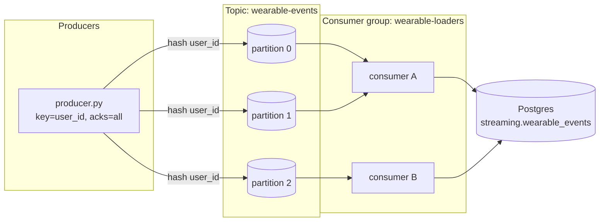

# Kafka topology

Topic `wearable-events`, 3 partitions, keyed by `user_id`, consumed by the
`wearable-loaders` group landing into Postgres. See
[ADR-0007](adr/0007-kafka.md).

- **Keying by `user_id`** → all of a user's events hash to the **same partition**
  → per-user ordering is preserved (verified: 0 users span >1 partition).
- **3 partitions** → the group scales to up to 3 parallel consumers; with 2
  consumers Kafka assigns 2 partitions to one and 1 to the other (verified split).
- **Group rebalancing**: when a consumer joins/leaves, Kafka reassigns partitions
  across the surviving members.
