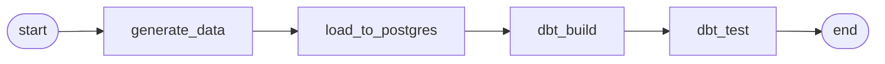

# Airflow orchestration

Airflow 2.9 (LocalExecutor) in Docker, orchestrating the synthetic-health
pipeline. See [ADR-0005](../../docs/adr/0005-airflow.md).

## DAGs



- **`health_pipeline`** — `generate → load → dbt build → dbt test`. Retries (2,
  exponential backoff), per-task SLAs, failure + SLA-miss callbacks (alert stubs),
  idempotent tasks, backfill-ready. Generates a *small* seeded dataset for fast
  demos.
- **`retry_demo`** — fails on attempt 1, succeeds on attempt 2; demonstrates
  retries + backoff + the failure callback.

## Run it

```bash
# 1) base data Postgres (creates the shared health-net network)
docker compose up -d postgres
# 2) airflow stack
docker compose -f orchestration/airflow/docker-compose.airflow.yml up -d
# UI: http://localhost:8080  (admin / admin)

# trigger from the CLI
docker exec ghl-airflow-scheduler airflow dags trigger health_pipeline
docker exec ghl-airflow-scheduler airflow dags trigger retry_demo
```

## Verified runs (local)

`health_pipeline` — all tasks success:

```
start            success
generate_data    success
load_to_postgres success
dbt_build        success
dbt_test         success
end              success
```

`retry_demo` — fail-then-retry proven by per-attempt logs:

```
attempt=1.log:  RuntimeError: deliberate first-attempt failure ...
attempt=1.log:  Marking task as UP_FOR_RETRY. dag_id=retry_demo ...
attempt=2.log:  succeeded on try=2
```

## Backfill

```bash
docker exec ghl-airflow-scheduler \
  airflow dags backfill -s 2025-01-01 -e 2025-01-03 health_pipeline
```

Tasks are idempotent (seeded generator, truncate+reload, deterministic dbt), so
each interval replays cleanly.
